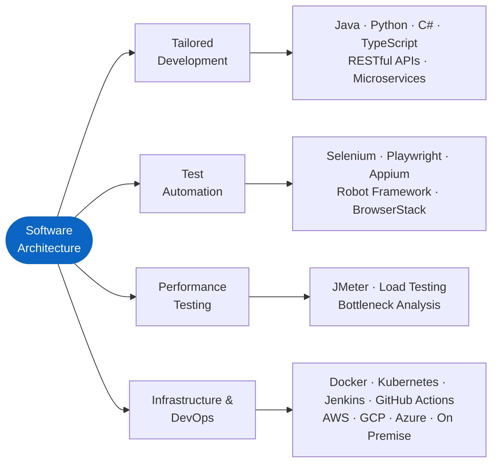

<div align="center">


<br/>

[](mailto:info@plaushkusolutions.com)

</div>

## About Me

Software Architect with 5+ years of experience delivering enterprise and startup software, QA transformation, and AI enabled solutions across international projects.

I design scalable architectures and build custom software, test automation frameworks, and performance testing strategies. I lead teams across the full software lifecycle, from requirements to production delivery.

Curious by nature: I like taking technologies apart to understand how they work, and I am always exploring new tools, languages, and ideas.

```text
Architecture      Scalable systems for startups and enterprise
Automation        AI assisted test automation for web and mobile
Performance       Load testing and scalability validation
Infrastructure    Cloud (AWS, GCP, Azure) and on premise environments
DevOps            CI/CD quality gates and release validation
```

<br/>

## Tech Stack

<div align="center">

**Languages & Frameworks**


**Automation & Testing**


**Infrastructure, DevOps & Data**


</div>

<br/>

## How I Work



<br/>

## AI Engineering

I integrate LLMs into SaaS products and test automation pipelines. Concrete work, not demos:

**Self healing test automation (Robot Framework)**

- Runtime interception of locator failures through the Robot Framework listener interface, before the test is marked as failed
- DOM subtree serialization at the point of failure, pruned to fit a fixed token budget instead of sending the whole page
- LLM generation of candidate XPath and CSS selectors from the serialized DOM plus the original locator and keyword context
- Validation of each candidate against the live page (uniqueness, visibility, attribute stability) before any retry
- Healed locators cached per suite run and emitted as a reviewable diff, so fixes land in version control instead of staying hidden at runtime

**LLM integration in SaaS products**

- Model API orchestration with structured output: JSON schema constrained responses, parse and validation layer, typed errors on malformed output
- Retry, timeout, and fallback policies across providers and model versions
- Prompt versioning treated like code: tracked in git, regression tested with fixed eval sets before every prompt or model change
- Token and latency budgets enforced per endpoint, with usage metering per tenant

**Coverage expansion through generation**

- Test case generation from requirements and OpenAPI specifications, including negative paths, boundary values, and invalid payloads
- Generated cases deduplicated against the existing suite and traced back to requirements, so coverage gain is measured, not assumed

<br/>

## Technical Expertise

| Area | Technologies |
|---|---|
| **Languages** | Java, Python, C#, TypeScript |
| **Test Automation** | Selenium, Selenide, Robot Framework, Playwright, Appium, BrowserStack |
| **Performance** | JMeter, load testing, scalability analysis, bottleneck detection |
| **API & Integration** | RESTful APIs, Postman, Pact, contract testing |
| **Infrastructure & DevOps** | Docker, Kubernetes, Jenkins, GitHub Actions, Azure DevOps, AWS, GCP, Azure, on premise environments |
| **Databases** | MySQL, PostgreSQL, Oracle DB |
| **Enterprise** | SAP Hybris, SAP CX, microservices architecture |
| **Security** | Burp Suite |
| **QA Management** | Test strategy, release management, defect management, Jira, Atlassian |

<br/>

## Featured Work

<table>
<tr>
<td width="50%" valign="top">

### AI Self Healing Automation

Architected and shipped a self healing mechanism for Robot Framework: locator failures are intercepted at runtime, repaired via LLM generated selectors, validated against the live page, and committed as reviewable diffs. Details in the AI Engineering section above.

</td>
<td width="50%" valign="top">

### Enterprise QA Transformation

Led automation and QA initiatives across international enterprise projects: e-commerce, public administration, mobile apps, and performance critical platforms.

</td>
</tr>
<tr>
<td colspan="2" valign="top">

### Training & Mentorship

Instructor for the RPA and Web Automation module at ITS Talent Factory. Delivered a 16 hour in person course on coding, automation, and practical engineering.

</td>
</tr>
</table>

<br/>

## Certifications & Memberships


<br/>

## Current Focus

- Software architecture for startup and enterprise applications
- Tailored development for business critical platforms
- AI assisted test automation
- Performance testing and scalability validation
- Staying curious: exploring new tools, AI technologies, and better ways to build software

<br/>

<div align="center">


</div>
